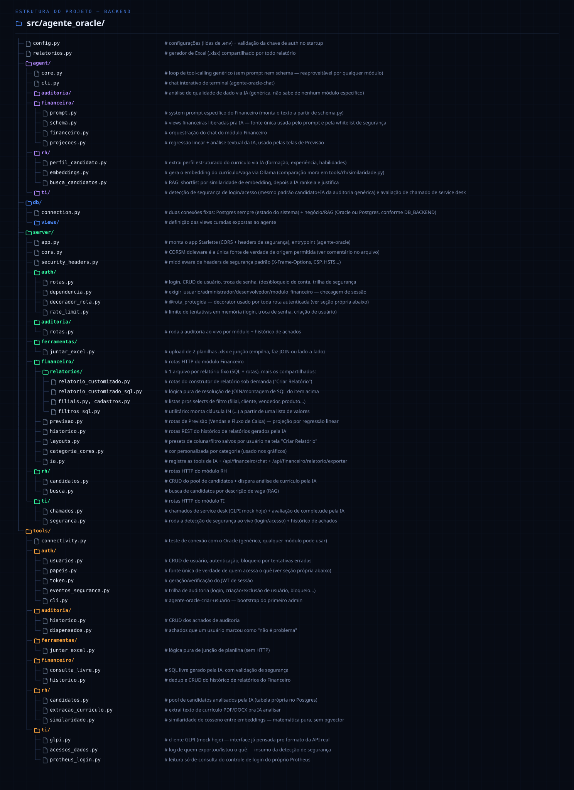
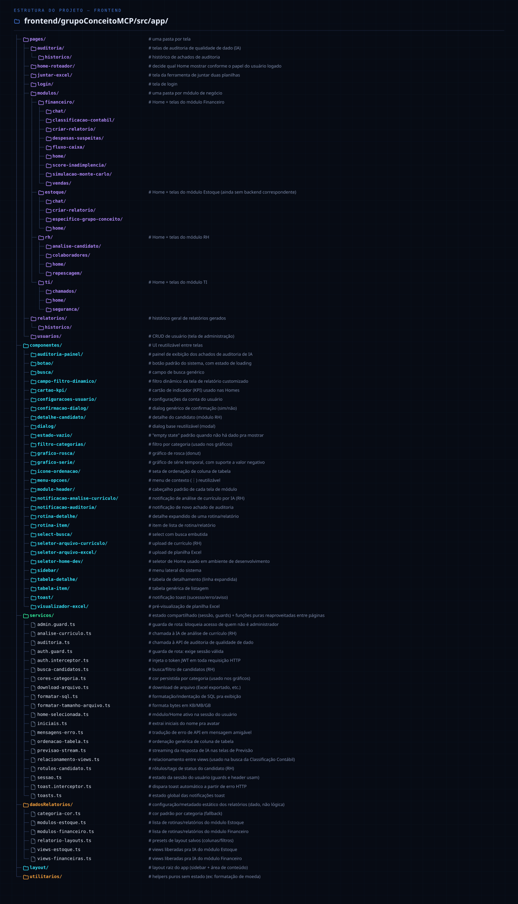

# Árvore de Diretórios

Visão completa da estrutura de pastas e arquivos do projeto — backend
(`src/agente_oracle/`) e frontend (`frontend/grupoConceitoMCP/src/app/`).
Complementa a versão em texto que fica no [README](../README.md#estrutura-do-projeto),
com um pouco mais de contexto por arquivo.

← [Voltar ao README](../README.md)

## Backend

<picture>
  <source media="(prefers-color-scheme: dark)" srcset="arvore-backend-dark.svg">
  <source media="(prefers-color-scheme: light)" srcset="arvore-backend-light.svg">
  
</picture>

## Frontend

<picture>
  <source media="(prefers-color-scheme: dark)" srcset="arvore-frontend-dark.svg">
  <source media="(prefers-color-scheme: light)" srcset="arvore-frontend-light.svg">
  
</picture>

---

Gerados por `docs/gerar_arvore.py` a partir dos dados de cada árvore
declarados no próprio script (sem dependência externa, só Python) — depois
de mudar a estrutura de pastas, edite os dados no topo do arquivo e rode:

```powershell
python docs/gerar_arvore.py
```

Isso regenera os quatro `.svg` (dark/light × backend/frontend) direto
nesta pasta.
